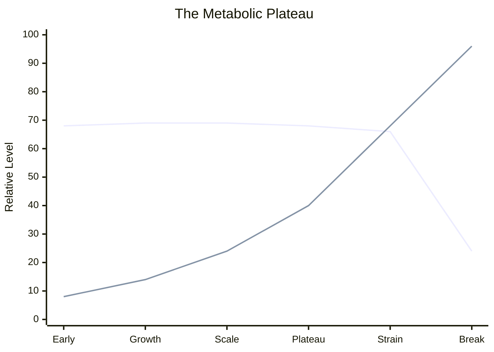

# The Entropy Framework

**Measuring engineering organizations the way biologists measure cells — not output, but the rate at which order degrades.**

---

## The Problem

Every engineering organization measures output. Velocity. Story points. Throughput. PRs merged. These metrics tell you how much ATP the cell produced. They tell you nothing about the free radical damage accumulating underneath.

A cell can produce normal energy for decades while its conversion machinery silently degrades. Biologists call this the metabolic plateau: everything looks stable until accumulated damage overwhelms repair capacity. Then the system fails, and nobody can explain why.

Engineering organizations have the same plateau. Sprints complete. Code ships. Velocity holds. Then one quarter it doesn't. The standard response is to pour in more energy — more engineers, more tools, more AI tokens. But fuel isn't the bottleneck. The conversion machinery is. Pouring more energy into degraded machinery produces more waste heat, not more work.

## The Thesis

**Stop measuring output. Start measuring the rate at which organizational order degrades.**

Not "how much are we producing?" but "how much disorder are we accumulating while we produce?"

That's a different question. It leads to different metrics, different interventions, and a fundamentally different understanding of what engineering leadership is actually managing.

The Entropy Framework answers this question by mapping engineering organizations onto biological thermodynamic systems — not as metaphor, but as measurement architecture. The mapping is rigorous. Each biological primitive (mitochondria, free radicals, ATP recycling, mitophagy, DNA integrity, metabolic plateau) corresponds to a measurable organizational signal extracted from existing artifact data (Git, JIRA, PR reviews).

## What it measures:

The framework combines two lenses:

- **SWR / SWR+I** asks: is this person's work externally directed or self-generated?
- **PS / CS / CD** asks: how do they behave inside the system once work arrives?

```text
========================================================================================
ENTROPY FRAMEWORK — ORG HEALTH SNAPSHOT
========================================================================================

Engineer                  SWR+I   Work Mode       PS     CS    CD   Reads As
----------------------------------------------------------------------------------------
Developer A                92%    DIRECTED      5,220  8,330  1.14  System Governor
Developer B                88%    DIRECTED        420  4,680  0.52  Selective Catalyst
Developer C                41%    SELF-DIRECTED 3,780    144  0.33  Production Engine
Developer D                27%    SELF-DIRECTED 2,940  1,560  0.28  High-Entropy Agent
Developer E                76%    MIXED            24  1,040  0.89  Depleting Catalyst

PS    = Production Signal  = commits x repos committed
CS    = Catalyst Signal    = reviews x repos reviewed
CD    = Catalyst Density   = inline comments / reviews
SWR+I = (Sanctioned + Inherited) / Total PRs
```

### Why these labels appear

- **Developer C -> Production Engine**  
  `PS` is high, but `CS` is low. This person produces a lot of code across many repos, but shows little review or governance influence in this snapshot.

- **Developer D -> High-Entropy Agent**  
  `PS` and `CS` both look strong at first glance, but `CD` is low. The volume is there; the review depth is not. That means a lot of activity with shallow catalytic effect, which is exactly the pattern the framework flags as entropy-producing.

- **Developer E -> Depleting Catalyst**  
  `PS` is almost gone, while `CS` stays high and `CD` stays substantive. This person is still acting as a real quality gate, but their own production is now minimal.

- **Developer A -> System Governor**  
  High `PS`, high `CS`, high `CD`. This is the rare profile that both ships and governs.

For the full archetype catalog and longer interpretations, see `examples/archetypes.md`.

This snapshot answers the first question immediately: who is shipping, who is governing quality, who is self-directing work, and where entropy is likely accumulating.

## Next Steps: Implementing Mitophagy

The framework tells you where entropy is accumulating. Fixing it means adding repair loops that force organizational memory, authority, and quality gates back into the work.

- **Require PR templates that capture intent.** Make every meaningful change explain architectural intent, affected contracts, and whether any existing runbook or rule is now stale.
- **Require Jira-linked work for every commit path.** If work ships without a ticket trail, you lose the authority chain that lets you distinguish sanctioned work from self-directed entropy.
- **Add Human Codex gates to the SDLC.** Define who declares success, who bears the consequences, who curates the local context, and who is allowed to calibrate trust in agentic output.



Visible velocity can look stable long after hidden entropy starts compounding. By the time output falls, the damage has already accumulated.

## The Two Documents

This framework rests on two pillars that answer two different questions:

**1. How do you measure organizational health?**
The thermodynamic model and its measurement layers. Developers are mitochondria — conversion units that take in energy and produce work. Some energy is always lost as waste heat. The framework measures conversion efficiency, free radical production, mutation classification, and catalytic potency — not from surveys or self-reports, but from the exhaust data that work naturally produces.

**2. What must humans provide that agents cannot?**
The Human Codex. As agentic execution transfers implementation authority to AI, four things remain irreducibly human: declaring what counts as success, bearing consequences, curating organizational context, and calibrating trust. These are not bottlenecks to be reduced — they are the governor whose quality bounds system health.

Together: the Entropy Framework measures whether the system is healthy. The Human Codex ensures the repair mechanism — the governed SDLC — keeps functioning. Measurement without governance is diagnosis without treatment. Governance without measurement is treatment without diagnosis.

## Framework Structure

```
entropy-framework/
|
+-- HUMAN-CODEX.md              The four pillars of irreducible human contribution
|
+-- framework/
|   +-- thermodynamic-model.md  The biological mapping and measurement layers
|   +-- metrics.md              Formulas, signals, and archetype classification
|   +-- intelligence-layer.md   Token-to-intelligence conversion measurement
|   +-- organizational-mitophagy.md   Self-improvement loops as repair mechanisms
|
+-- tools/
|   +-- README.md               How to run the extraction and analysis tools
|   +-- extract_github.py       GitHub commit, PR, and review data extraction
|   +-- extract_jira_swr.py     JIRA ticket origin and authority chain analysis
|   +-- analyze_archetypes.py   Developer archetype classification from extracted data
|
+-- examples/
|   +-- archetypes.md           Anonymized developer archetype profiles
|   +-- case-studies.md         Anonymized patterns and organizational signals
```

## Core Concepts

**Mitochondria = Developers.** Conversion units that take input (tickets, specs, requirements) and produce output (shipped code). Never 100% efficient. The efficiency question is not "are developers working hard enough?" but "how much of their energy converts to useful work vs waste heat?"

**Free Radicals = Byproducts of inefficient conversion.** Bugs from rushed features. Technical debt from code that compiles but doesn't align with architecture. Tribal knowledge that exists only in one person's head. Each byproduct damages the system and creates more work downstream. The vicious cycle.

**Mitophagy = The repair mechanism.** The cell identifies damaged mitochondria, breaks them down, and rebuilds. The organizational equivalent: a governed development process that catches architectural drift, enforces contracts, feeds lessons back into the system. Not for productivity. For repair.

**The Metabolic Plateau = The silent accumulation.** Metabolism stays constant from age 20 to 60. The real decline only begins when accumulated damage overwhelms repair capacity. Organizations absorb entropy for years before symptoms appear. The telemetry is the blood test that detects damage before symptoms surface.

**Catalysts = Non-linear contributors.** People whose direct output (commits, lines of code) understates their contribution by orders of magnitude. One rule they write shapes 2,000 PRs. One contract template prevents an entire class of architectural drift. Traditional metrics see them as underperforming. The framework sees them as the system's metabolic regulators.

## Measurement Principle

**Instrument artifacts, not people.**

The data already exists as a natural byproduct of work. Git commits, PR reviews, JIRA tickets, Slack conversations — these are exhaust, not testimony. Nobody changes how they write a PR because someone reads git history six months later. The data is already honest. You just need to read it.

Measure late, from artifacts, without announcing what you're measuring until the analysis is done. Classification over counting. Attribution chains over direct measurement. Comparative, not absolute. The moment you tell developers what you're tracking, they optimize for the metric instead of the work. The metric degrades. The measurement tool becomes the thing that damages what you're measuring.

## Who This Is For

Engineering leaders who suspect their organization is accumulating disorder faster than it's repairing it — and want a measurement framework that makes the invisible visible.

Builders of agentic systems who need a governance model that keeps human judgment in the loop as AI capability increases.

Anyone who has watched velocity hold steady while the codebase silently rotted, and wondered: what should we have been measuring instead?

---

*"We are a temporary, beautiful arrangement of atoms — a flame that persists by processing energy. Aging is the universe following its own honest rules. Organizations are the same. The honest rules apply. The question is whether you measure them or pretend they don't exist."*

## Scope

This repository contains the **framework and measurement tools** — the theory, the formulas, and the scripts that extract and classify data. It does not contain SDLC implementation artifacts (contract templates, plan formats, brief-to-task pipelines). The framework describes what mitophagy looks like; it does not prescribe a specific governed SDLC to implement it. That's intentional — the repair mechanism must be adapted to each organization's existing processes.

Some metrics defined in the framework documents (Amplification Ratio, Completion Ratio, FTR, IQ) do not have reference implementations bundled. The raw data needed for most of them is present in the extracted output. See `tools/README.md` for the full implementation status.

**Author:** Arkadi Kizner
**License:** CC-BY-SA 4.0
**Status:** Active research, April 2026
