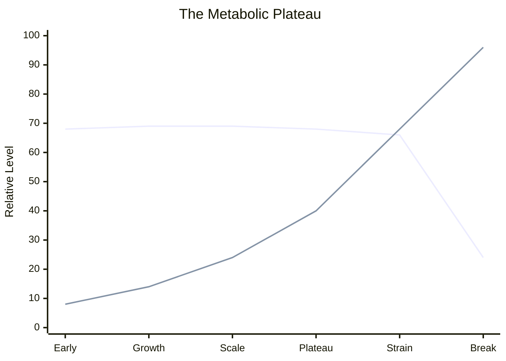

# Root README Viral Improvements Implementation Plan

> **For agentic workers:** REQUIRED SUB-SKILL: Use superpowers:subagent-driven-development (recommended) or superpowers:executing-plans to implement this plan task-by-task. Steps use checkbox (`- [ ]`) syntax for tracking.

**Goal:** Rework the root `README.md` so it proves the framework's value within the first screenful while preserving the repository's philosophical voice.

**Architecture:** Keep the existing thesis and biological framing, but move proof of value earlier by inserting a terminal-style showcase, an explicit archetype decoding bridge, a practical "Next Steps" breadcrumb, and one minimal plateau visual. Restrict implementation to documentation changes in `README.md`; do not change formulas, tool behavior, or repository structure beyond the plan/spec docs already created.

**Tech Stack:** Markdown, Mermaid (for a minimal plateau chart), existing repository docs, existing Python analysis scripts as read-only references

---

## File Map

- Modify: `README.md`
  - Add a new proof-first `What it measures:` section near the top.
  - Add a short legend that separates `SWR+I` from `PS / CS / CD`.
  - Add a `Why these labels appear` bridge that decodes sample archetypes.
  - Add a `Next Steps: Implementing Mitophagy` section.
  - Add one minimal Mermaid plateau visual.
  - Keep the deeper theory sections intact, only tightening transitions if needed.

- Reference only: `examples/archetypes.md`
  - Source of anonymized archetype examples used in the new bridge.

- Reference only: `tools/analyze_archetypes.py`
  - Source of archetype classification logic and signal names.

- Reference only: `tools/extract_jira_swr.py`
  - Source of `SWR` / `SWR+I` terminology and work-mode language.

## Task 1: Add the proof-first showcase block

**Files:**
- Modify: `README.md`
- Reference: `examples/archetypes.md`
- Reference: `tools/analyze_archetypes.py`
- Reference: `tools/extract_jira_swr.py`

- [ ] **Step 1: Insert `What it measures:` after `## The Thesis` and before `## The Two Documents`**

````md
## What it measures:

The framework combines two different lenses:

- **SWR / SWR+I** asks: is this person's work externally directed or self-generated?
- **PS / CS / CD** asks: how do they behave inside the system once work arrives?

```text
========================================================================================
ENTROPY FRAMEWORK — ORG HEALTH SNAPSHOT
========================================================================================

Engineer                  SWR+I   Work Mode       PS     CS    CD   Reads As
----------------------------------------------------------------------------------------
Developer A                92%    DIRECTED      5,220  8,330  1.14  System Governor
Developer B                88%    DIRECTED        420  4,680  0.52  Selective Catalyst
Developer C                41%    SELF-DIRECTED 3,780    144  0.33  Production Engine
Developer D                27%    SELF-DIRECTED 2,940  1,560  0.28  High-Entropy Agent
Developer E                76%    MIXED            24  1,040  0.89  Depleting Catalyst

PS    = Production Signal  = commits x repos committed
CS    = Catalyst Signal    = reviews x repos reviewed
CD    = Catalyst Density   = inline comments / reviews
SWR+I = (Sanctioned + Inherited) / Total PRs
```

Seeing this snapshot answers the first question immediately: who is shipping, who is governing quality, who is self-directing work, and where entropy is probably accumulating.
````

- [ ] **Step 2: Verify the new section and code block exist exactly once**

Run: `rg -n "## What it measures:|ENTROPY FRAMEWORK — ORG HEALTH SNAPSHOT|SWR\\+I = \\(Sanctioned \\+ Inherited\\) / Total PRs" README.md`

Expected: three matches, all in the newly inserted block.

- [ ] **Step 3: Commit the showcase insertion**

```bash
git add README.md
git commit -m "docs: move entropy proof to the README opening"
```

## Task 2: Decode the archetype labels so the table is self-explanatory

**Files:**
- Modify: `README.md`
- Reference: `examples/archetypes.md`
- Reference: `tools/analyze_archetypes.py`

- [ ] **Step 1: Add `Why these labels appear` directly under the showcase**

```md
### Why these labels appear

- **Developer C -> Production Engine**  
  `PS` is high, but `CS` is low. This person produces a lot of code across many repos, but exerts little review or governance influence on the rest of the system.

- **Developer D -> High-Entropy Agent**  
  `PS` and `CS` both look strong at first glance, but `CD` is low. The volume is there; the review depth is not. That means a lot of activity with shallow catalytic effect, which is exactly the pattern the framework flags as entropy-producing.

- **Developer E -> Depleting Catalyst**  
  `PS` is almost gone, while `CS` stays high and `CD` stays substantive. This person is still acting as a real quality gate, but their own production has collapsed.

- **Developer A -> System Governor**  
  High `PS`, high `CS`, high `CD`. This is the rare profile that both ships and governs.

For the full archetype catalog and longer interpretations, see `examples/archetypes.md`.
```

- [ ] **Step 2: Verify the bridge calls out the intended examples**

Run: `rg -n "Why these labels appear|Developer C -> Production Engine|Developer D -> High-Entropy Agent|Developer E -> Depleting Catalyst|examples/archetypes.md" README.md`

Expected: one match for the heading, three matches for the decoded examples, and one match for the example-catalog link.

- [ ] **Step 3: Commit the archetype bridge**

```bash
git add README.md
git commit -m "docs: explain archetype labels in the README"
```

## Task 3: Add the treatment breadcrumb and the minimal plateau visual

**Files:**
- Modify: `README.md`

- [ ] **Step 1: Add `Next Steps: Implementing Mitophagy` immediately after the archetype bridge**

```md
## Next Steps: Implementing Mitophagy

The framework tells you where entropy is accumulating. Fixing it means adding repair loops that force organizational memory, authority, and quality gates back into the work.

- **Require PR templates that capture intent.** Make every meaningful change explain architectural intent, affected contracts, and whether any existing runbook or rule is now stale.
- **Require Jira-linked work for every commit path.** If work ships without a ticket trail, you lose the authority chain that lets you distinguish sanctioned work from self-directed entropy.
- **Add Human Codex gates to the SDLC.** Define who declares success, who bears the consequences, who curates the local context, and who is allowed to calibrate trust in agentic output.
```

- [ ] **Step 2: Add a small plateau visual right under the next-steps section**

````md


Visible velocity can look stable long after hidden entropy starts compounding. By the time output falls, the damage has already accumulated.
````

- [ ] **Step 3: Verify the section and chart markers exist**

Run: `rg -n "## Next Steps: Implementing Mitophagy|^```mermaid$|The Metabolic Plateau|Visible velocity can look stable" README.md`

Expected: the section heading appears once, the Mermaid block marker appears once, the chart title appears once, and the explanatory sentence appears once.

- [ ] **Step 4: Commit the mitigation bridge and visual**

```bash
git add README.md
git commit -m "docs: add mitigation breadcrumb and plateau visual"
```

## Task 4: Tighten the top-half pacing and verify section order

**Files:**
- Modify: `README.md`

- [ ] **Step 1: Read the top half in order and make only pacing edits that support the new flow**

Keep these constraints while editing:

```md
- Do not weaken the opening thesis.
- Do not remove the existing `## The Problem`, `## The Thesis`, or `## The Two Documents` sections.
- Do not add a literal biology mapping diagram.
- Do not contradict the existing scope boundary that says this repository does not prescribe one governed SDLC.
```

- [ ] **Step 2: Verify the section order matches the intended narrative**

Run: `rg -n "^## " README.md`

Expected section order at the top:

```text
## The Problem
## The Thesis
## What it measures:
## Next Steps: Implementing Mitophagy
## The Two Documents
```

- [ ] **Step 3: Review the final diff for voice, redundancy, and scope drift**

Run: `git diff -- README.md`

Expected: the diff is confined to `README.md`, the new sections appear before `## The Two Documents`, and the existing `## Scope` language still reads as diagnosis-first rather than prescriptive SDLC doctrine.

- [ ] **Step 4: Commit the pacing polish**

```bash
git add README.md
git commit -m "docs: tighten README flow for first-screen clarity"
```

